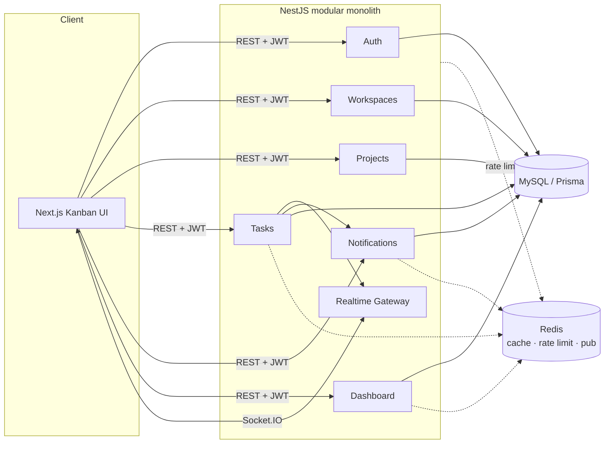
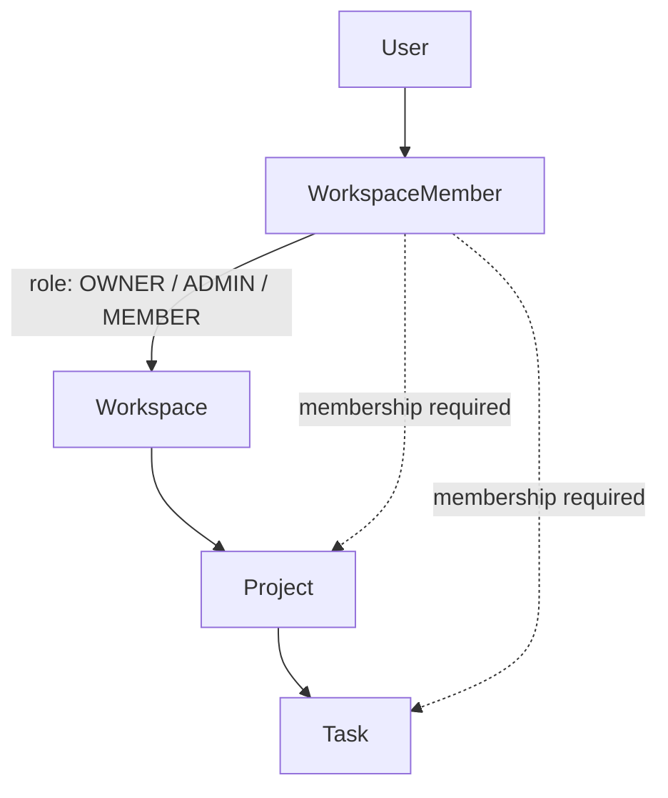
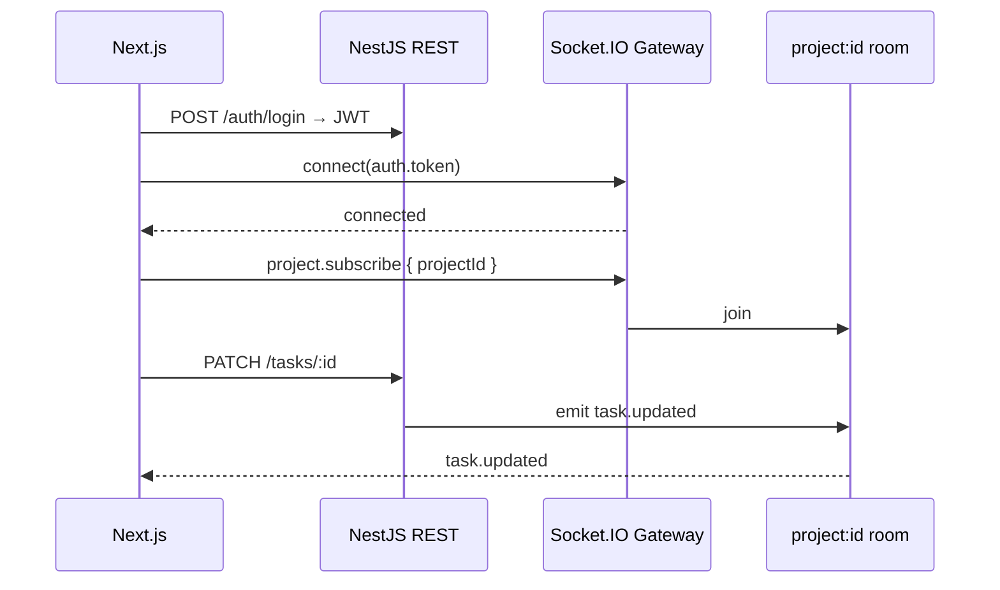

# Architecture

TeamFlow uses a **modular monolith** NestJS API and a Next.js App Router frontend.

## Modules (API)

| Module | Responsibility |
| --- | --- |
| `auth` | Register/login, JWT |
| `users` | Current user profile |
| `workspaces` | Multi-tenant containers + RBAC membership |
| `projects` | Boards owned by a workspace |
| `tasks` | Kanban cards, comments, filters, pagination |
| `notifications` | Persist + Redis publish |
| `dashboard` | Aggregated stats (Redis-cached) |
| `realtime` | Socket.IO gateway for live board updates |
| `redis` | Shared ioredis client |
| `prisma` | DB access |

## Permission model

Workspace membership roles: `OWNER`, `ADMIN`, `MEMBER`. Access to projects/tasks is gated by membership on the parent workspace.

## Real-time path

## Why modular monolith

Fits a small team portfolio: clear module boundaries without distributed-system overhead. Modules can later extract to services if load demands it.
