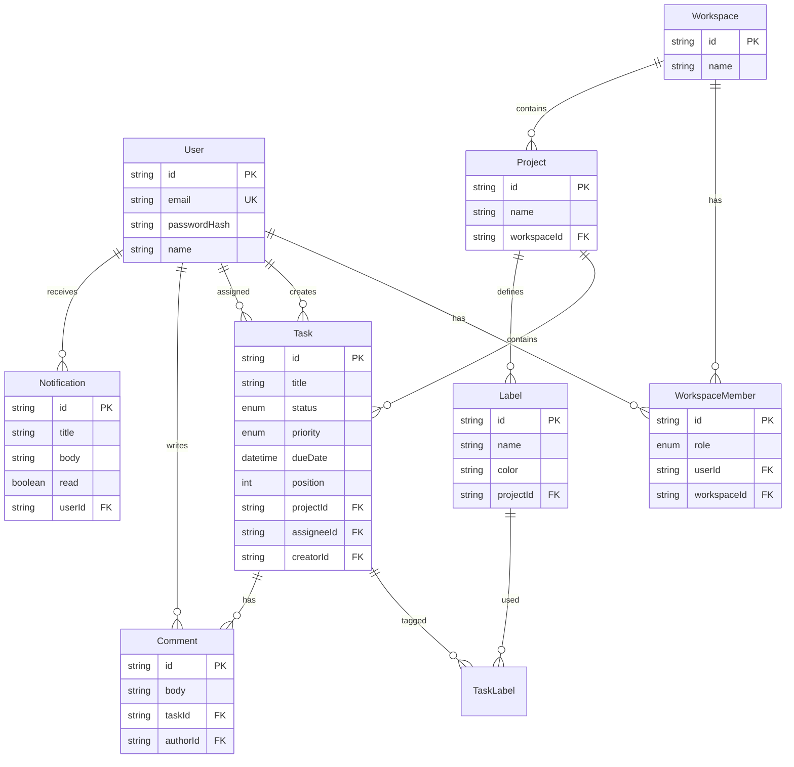

# Database ER diagram

```mermaid
erDiagram
  User ||--o{ WorkspaceMember : has
  Workspace ||--o{ WorkspaceMember : has
  Workspace ||--o{ Project : contains
  Project ||--o{ Task : contains
  Project ||--o{ Label : defines
  Task ||--o{ TaskLabel : tagged
  Label ||--o{ TaskLabel : used
  User ||--o{ Task : creates
  User ||--o{ Task : assigned
  Task ||--o{ Comment : has
  User ||--o{ Comment : writes
  User ||--o{ Notification : receives

  User {
    string id PK
    string email UK
    string passwordHash
    string name
  }
  Workspace {
    string id PK
    string name
  }
  WorkspaceMember {
    string id PK
    enum role
    string userId FK
    string workspaceId FK
  }
  Project {
    string id PK
    string name
    string workspaceId FK
  }
  Task {
    string id PK
    string title
    enum status
    enum priority
    datetime dueDate
    int position
    string projectId FK
    string assigneeId FK
    string creatorId FK
  }
  Label {
    string id PK
    string name
    string color
    string projectId FK
  }
  Comment {
    string id PK
    string body
    string taskId FK
    string authorId FK
  }
  Notification {
    string id PK
    string title
    string body
    boolean read
    string userId FK
  }
```

## Enums

- `Role`: OWNER | ADMIN | MEMBER  
- `TaskStatus`: BACKLOG | TODO | IN_PROGRESS | DONE  
- `TaskPriority`: LOW | MEDIUM | HIGH | URGENT  
